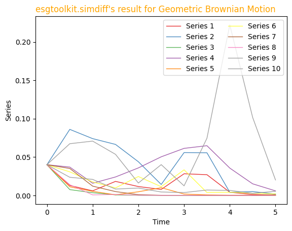

# Example of use of `esgtoolkit` in Python 

## 1 - Install and import packages


```python
!pip install matplotlib numpy pandas esgtoolkit
```

    Requirement already satisfied: matplotlib in /workspaces/esgtoolkit_python/venv/lib/python3.10/site-packages (3.8.2)
    Collecting numpy
      Using cached numpy-1.26.2-cp310-cp310-manylinux_2_17_x86_64.manylinux2014_x86_64.whl.metadata (61 kB)
    Collecting pandas
      Using cached pandas-2.1.4-cp310-cp310-manylinux_2_17_x86_64.manylinux2014_x86_64.whl.metadata (18 kB)
    Collecting esgtoolkit
      Downloading esgtoolkit-1.0.0-py2.py3-none-any.whl.metadata (898 bytes)
    Requirement already satisfied: contourpy>=1.0.1 in /workspaces/esgtoolkit_python/venv/lib/python3.10/site-packages (from matplotlib) (1.2.0)
    Requirement already satisfied: cycler>=0.10 in /workspaces/esgtoolkit_python/venv/lib/python3.10/site-packages (from matplotlib) (0.12.1)
    Requirement already satisfied: fonttools>=4.22.0 in /workspaces/esgtoolkit_python/venv/lib/python3.10/site-packages (from matplotlib) (4.46.0)
    Requirement already satisfied: kiwisolver>=1.3.1 in /workspaces/esgtoolkit_python/venv/lib/python3.10/site-packages (from matplotlib) (1.4.5)
    Requirement already satisfied: packaging>=20.0 in /workspaces/esgtoolkit_python/venv/lib/python3.10/site-packages (from matplotlib) (23.2)
    Requirement already satisfied: pillow>=8 in /workspaces/esgtoolkit_python/venv/lib/python3.10/site-packages (from matplotlib) (10.1.0)
    Requirement already satisfied: pyparsing>=2.3.1 in /workspaces/esgtoolkit_python/venv/lib/python3.10/site-packages (from matplotlib) (3.1.1)
    Collecting python-dateutil>=2.7 (from matplotlib)
      Downloading python_dateutil-2.8.2-py2.py3-none-any.whl (247 kB)
         ━━━━━━━━━━━━━━━━━━━━━━━━━━━━━━━━━━━━━━━ 247.7/247.7 kB 4.7 MB/s eta 0:00:0000:01
    [?25hCollecting pytz>=2020.1 (from pandas)
      Downloading pytz-2023.3.post1-py2.py3-none-any.whl.metadata (22 kB)
    Collecting tzdata>=2022.1 (from pandas)
      Downloading tzdata-2023.3-py2.py3-none-any.whl (341 kB)
         ━━━━━━━━━━━━━━━━━━━━━━━━━━━━━━━━━━━━━━━ 341.8/341.8 kB 6.9 MB/s eta 0:00:0000:01
    [?25hRequirement already satisfied: rpy2>=3.4.5 in /workspaces/esgtoolkit_python/venv/lib/python3.10/site-packages (from esgtoolkit) (3.5.14)
    Collecting scipy (from esgtoolkit)
      Downloading scipy-1.11.4-cp310-cp310-manylinux_2_17_x86_64.manylinux2014_x86_64.whl.metadata (60 kB)
         ━━━━━━━━━━━━━━━━━━━━━━━━━━━━━━━━━━━━━━━━ 60.4/60.4 kB 1.3 MB/s eta 0:00:00ta 0:00:01
    [?25hCollecting six>=1.5 (from python-dateutil>=2.7->matplotlib)
      Downloading six-1.16.0-py2.py3-none-any.whl (11 kB)
    Requirement already satisfied: cffi>=1.10.0 in /workspaces/esgtoolkit_python/venv/lib/python3.10/site-packages (from rpy2>=3.4.5->esgtoolkit) (1.16.0)
    Requirement already satisfied: jinja2 in /workspaces/esgtoolkit_python/venv/lib/python3.10/site-packages (from rpy2>=3.4.5->esgtoolkit) (3.1.2)
    Requirement already satisfied: tzlocal in /workspaces/esgtoolkit_python/venv/lib/python3.10/site-packages (from rpy2>=3.4.5->esgtoolkit) (5.2)
    Requirement already satisfied: pycparser in /workspaces/esgtoolkit_python/venv/lib/python3.10/site-packages (from cffi>=1.10.0->rpy2>=3.4.5->esgtoolkit) (2.21)
    Requirement already satisfied: MarkupSafe>=2.0 in /workspaces/esgtoolkit_python/venv/lib/python3.10/site-packages (from jinja2->rpy2>=3.4.5->esgtoolkit) (2.1.3)
    Downloading numpy-1.26.2-cp310-cp310-manylinux_2_17_x86_64.manylinux2014_x86_64.whl (18.2 MB)
       ━━━━━━━━━━━━━━━━━━━━━━━━━━━━━━━━━━━━━━━━ 18.2/18.2 MB 37.7 MB/s eta 0:00:00:00:0100:01
    [?25hDownloading pandas-2.1.4-cp310-cp310-manylinux_2_17_x86_64.manylinux2014_x86_64.whl (12.3 MB)
       ━━━━━━━━━━━━━━━━━━━━━━━━━━━━━━━━━━━━━━━━ 12.3/12.3 MB 43.6 MB/s eta 0:00:00:00:010:01
    [?25hDownloading esgtoolkit-1.0.0-py2.py3-none-any.whl (7.2 kB)
    Downloading pytz-2023.3.post1-py2.py3-none-any.whl (502 kB)
       ━━━━━━━━━━━━━━━━━━━━━━━━━━━━━━━━━━━━━━━━ 502.5/502.5 kB 9.7 MB/s eta 0:00:00:00:01
    [?25hDownloading scipy-1.11.4-cp310-cp310-manylinux_2_17_x86_64.manylinux2014_x86_64.whl (36.4 MB)
       ━━━━━━━━━━━━━━━━━━━━━━━━━━━━━━━━━━━━━━━━ 36.4/36.4 MB 25.2 MB/s eta 0:00:00:00:0100:01
    [?25hInstalling collected packages: pytz, tzdata, six, numpy, scipy, python-dateutil, pandas, esgtoolkit
    Successfully installed esgtoolkit-1.0.0 numpy-1.26.2 pandas-2.1.4 python-dateutil-2.8.2 pytz-2023.3.post1 scipy-1.11.4 six-1.16.0 tzdata-2023.3


```python
import matplotlib.pyplot as plt
import numpy as np
import pandas as pd
from esgtoolkit import simdiff
```

## 2 - Code examples

### 2 - 1 Ornstein-Uhlenbeck process 


```python
kappa = 1.5
V0 = theta = 0.04
sigma_v = 0.2
theta1 = kappa * theta
theta2 = kappa
theta3 = sigma_v

sims_OU = simdiff(
    n=7,
    horizon=5,
    frequency="quarterly",
    model="OU",
    x0=V0,
    theta1=theta1,
    theta2=theta2,
    theta3=theta3,
)

print(sims_OU)
```

          Series 1  Series 2  Series 3  Series 4  Series 5  Series 6  Series 7
    0.00  0.040000  0.040000  0.040000  0.040000  0.040000  0.040000  0.040000
    0.25 -0.007010 -0.049564 -0.018269  0.071842  0.040483 -0.019586  0.049868
    0.50 -0.011616 -0.039839 -0.017487  0.019752  0.072648  0.020594 -0.032688
    0.75  0.135263 -0.100929 -0.105646 -0.001864  0.031349  0.005971 -0.051103
    1.00  0.111387 -0.117995  0.121822 -0.074206  0.088102 -0.012538 -0.044094
    1.25  0.099907 -0.121014  0.197554 -0.128390  0.054566 -0.075927  0.136858
    1.50  0.225026 -0.212136  0.054084 -0.050274  0.077840 -0.043452  0.051887
    1.75  0.205826 -0.063020  0.015887  0.015550  0.158005 -0.083190  0.067913
    2.00  0.047863 -0.017940 -0.015713  0.027641  0.157605 -0.184567  0.065723
    2.25 -0.012206 -0.095284  0.067129  0.108862  0.093491 -0.146234 -0.022997
    2.50 -0.033261  0.052185  0.051653  0.259280  0.173120 -0.010915 -0.009278
    2.75  0.092319  0.084145  0.069256  0.149523  0.214823 -0.043251  0.127294
    3.00  0.106138  0.045591  0.057713 -0.078409  0.206151  0.033776  0.137867
    3.25  0.119071  0.118922  0.048578  0.042976  0.174218 -0.099979  0.110721
    3.50  0.103628  0.167896  0.160688 -0.017439  0.079580 -0.060866  0.053169
    3.75  0.037109  0.196812  0.104011 -0.057185  0.181329  0.014241 -0.123167
    4.00  0.187892  0.205535  0.211189  0.059226  0.086787  0.047556  0.022749
    4.25  0.183402  0.200231  0.027754  0.029329  0.255620  0.054057 -0.094369
    4.50 -0.026393  0.144932  0.080618 -0.069723  0.316742 -0.004079  0.009713
    4.75  0.053196  0.086456  0.078305 -0.020204  0.210432 -0.061564  0.179312
    5.00  0.009414  0.040016  0.084439 -0.013027  0.071045 -0.115703  0.014640


### 2 - 2 Geometric Brownian motion


```python
sims_GBM = simdiff(
    n=10,
    horizon=5,
    frequency="semi-annual",
    model="GBM",
    x0=V0,
    theta1=theta1,
    theta2=theta2,
    theta3=theta3,
)

print(sims_GBM)
```

         Series 1  Series 2      Series 3  Series 4  Series 5  Series 6  Series 7  \
    0.0  0.040000  0.040000  4.000000e-02  0.040000  0.040000  0.040000  0.040000   
    0.5  0.012960  0.086032  7.566884e-03  0.036919  0.011241  0.030725  0.035130   
    1.0  0.005961  0.073984  3.525718e-03  0.015851  0.005294  0.017501  0.012107   
    1.5  0.018284  0.066449  6.972174e-04  0.024051  0.000812  0.009819  0.004992   
    2.0  0.011569  0.043875  1.889517e-04  0.035840  0.004758  0.024617  0.000995   
    2.5  0.007791  0.014286  5.717045e-05  0.050299  0.010060  0.011376  0.000187   
    3.0  0.028206  0.055817  5.609877e-06  0.061307  0.001795  0.033362  0.000152   
    3.5  0.027002  0.055569  8.009562e-06  0.064775  0.000687  0.003789  0.000143   
    4.0  0.004144  0.004052  5.533457e-06  0.035614  0.000246  0.004136  0.000089   
    4.5  0.001174  0.005006  9.715489e-07  0.015116  0.000330  0.002770  0.000139   
    5.0  0.000430  0.001780  2.156546e-06  0.005928  0.000178  0.002045  0.000718   
    
         Series 8  Series 9  Series 10  
    0.0  0.040000  0.040000   0.040000  
    0.5  0.013951  0.023629   0.067367  
    1.0  0.000707  0.020877   0.070761  
    1.5  0.001207  0.008273   0.053518  
    2.0  0.000334  0.009621   0.016144  
    2.5  0.000095  0.004471   0.040134  
    3.0  0.000165  0.003732   0.012467  
    3.5  0.000071  0.007014   0.074483  
    4.0  0.000011  0.006534   0.222215  
    4.5  0.000008  0.002715   0.101611  
    5.0  0.000004  0.005391   0.020085  


## 3 - Spaghetti plot


```python
#plt.style.use('seaborn-darkgrid')
 
palette = plt.get_cmap('Set1')
 
for num, column in enumerate(sims_GBM):
    
    plt.plot(sims_GBM.index, sims_GBM[column], marker='', color=palette(num), linewidth=1, alpha=0.9, label=column)

# Add legend
plt.legend(loc=1, ncol=2)
 
# Add titles
plt.title("esgtoolkit.simdiff's result for Geometric Brownian Motion", loc='left', fontsize=12, fontweight=0, color='orange')
plt.xlabel("Time")
plt.ylabel("Series")

# Show the graph
plt.show()
```


    

    

